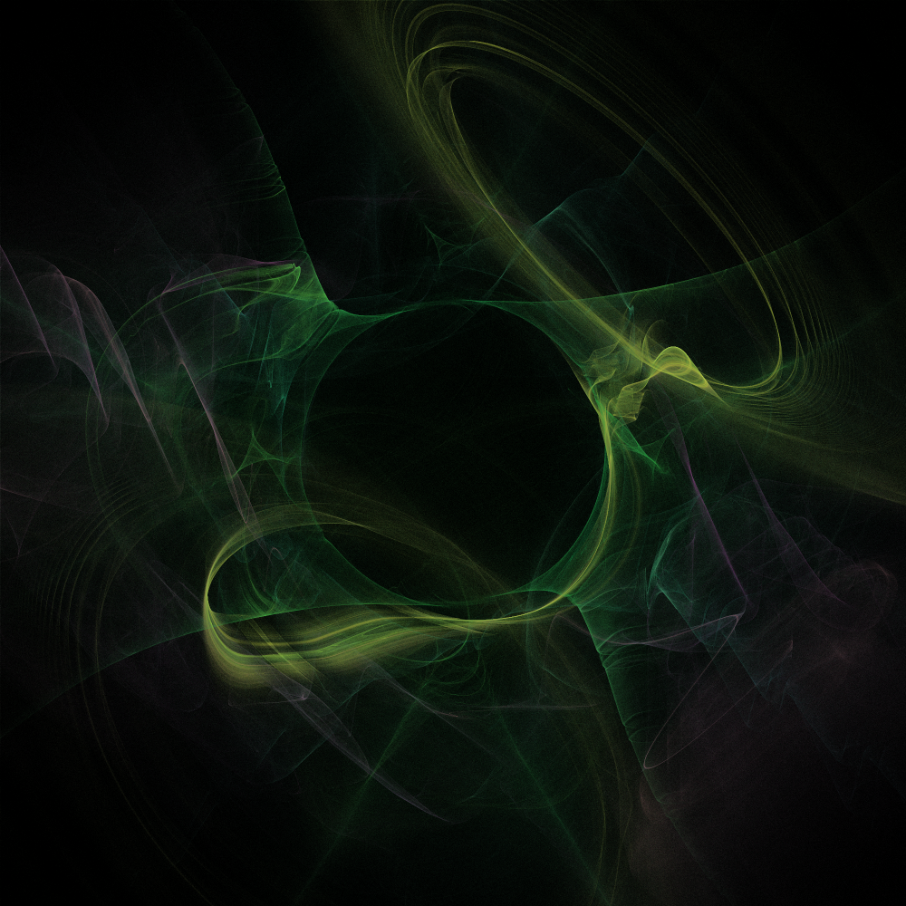

# Fractal Flame Viewer

This is a Java fractal flame generator I wrote in 2016 for a course project. Occasional development on this project continued into 2019 as I made changes for demos,
especially at University of Kentucky's Lexmark E-day.

More information about this software can be found at [https://www.cs.uky.edu/~acta225/flame/](https://www.cs.uky.edu/~acta225/flame/).

